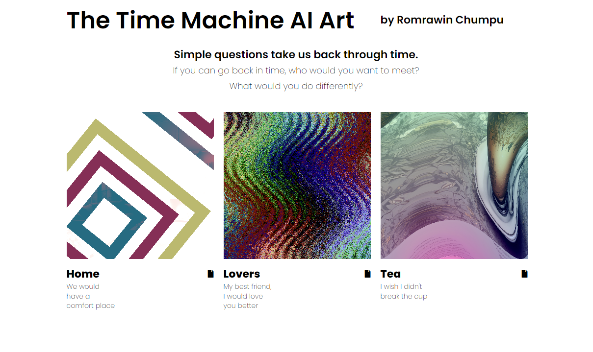

# ⌛ The Time Machine AI Art

By Romrawin (Jin) Chumpu

---

## Description

This work is generated in March, 2024.

The artwork is a combination of images generated prompts from two questions:

1. If you could go back in time, who would you want to meet?
2. What would you do differently?

These questions are intentionally used to prompt the audience and evoke the theme of memories in "The Time Machine."

After generating the image, we process it and combine it with a GLSL shader for display on the website. This procedural interaction incorporates mathematical equations and artistic reflections. The resulting artwork can be appreciated by considering both the generated images and the emotions evoked by the text prompts.

[Click here](https://the-time-machine-aiart.github.io/) will take you to see the artworks.

**Enjoy these artworks?** [☕ Buy me a coffee.](https://www.buymeacoffee.com/romrawinjp)

## Acknowledgement

- Good way to learn shader is [The Book of Shaders](https://thebookofshaders.com/) by Patricio Gonzalez Vivo.

- This gallery website is modified from [30 Days of Shade](http://30daysofshade.com/) by willstall.
